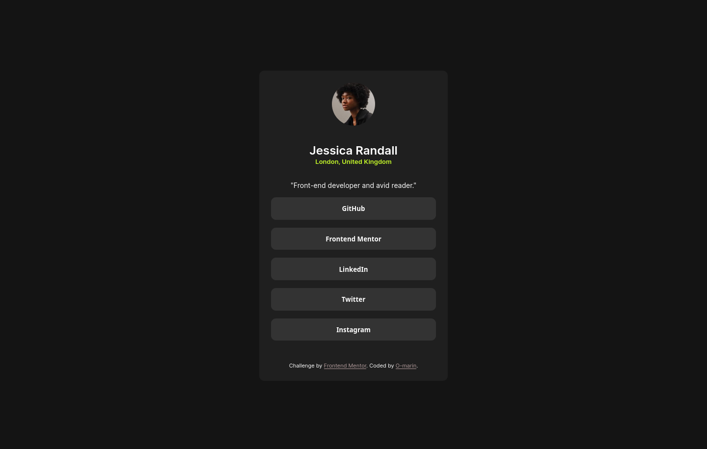

# Frontend Mentor - Social links profile solution

This is a solution to the [Social links profile challenge on Frontend Mentor](https://www.frontendmentor.io/challenges/social-links-profile-UG32l9m6dQ). Frontend Mentor challenges help you improve your coding skills by building realistic projects. 

## Table of contents

- [Overview](#overview)
  - [The challenge](#the-challenge)
  - [Screenshot](#screenshot)
  - [Links](#links)
- [My process](#my-process)
  - [Built with](#built-with)
- [Author](#author)

**Note: Delete this note and update the table of contents based on what sections you keep.**

## Overview
Webpage or Segment for Social Links. The proyect was divided in two sections, one containing an image, owner, city of residence and a brief description  of the profile,  and a second section containing the links to social media.

### The challenge

Users should be able to:

- See hover and focus states for all interactive elements on the page

### Screenshot

### Links

- Solution URL: [Social Links](https://github.com/O-Marin/socialsProfileLink)
- Live Site URL: [Social Link Git Pages](https://o-marin.github.io/socialsProfileLink/)

## My process

first always read the documentation and see the design model.
After placing down the html, I started assigning the background colors., font colors and weights
Then continue working with the margins and paddings to set the final position of the main section. And give the buttons the style given in the design.

### Built with

- Semantic HTML5 markup
- CSS custom properties
- Flexbox
- CSS Grid
- Mobile-first workflow

## Author

- Frontend Mentor - [@O-Marin](https://www.frontendmentor.io/profile/O-Marin)

